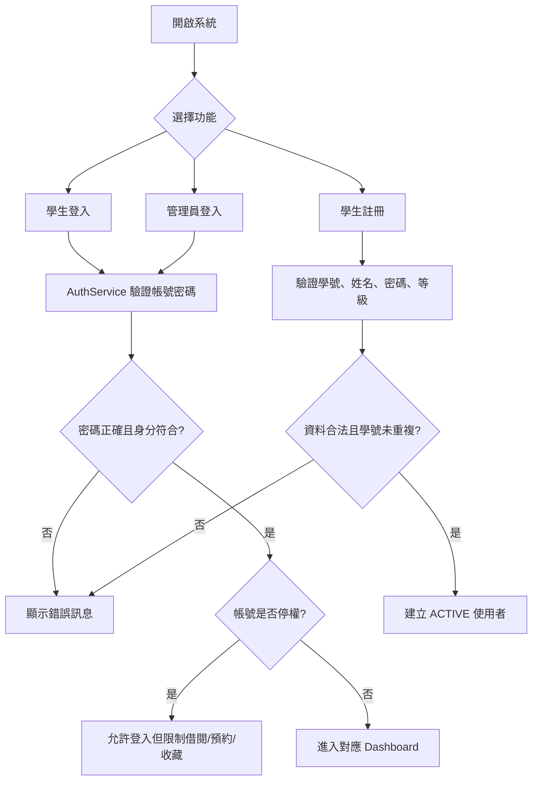
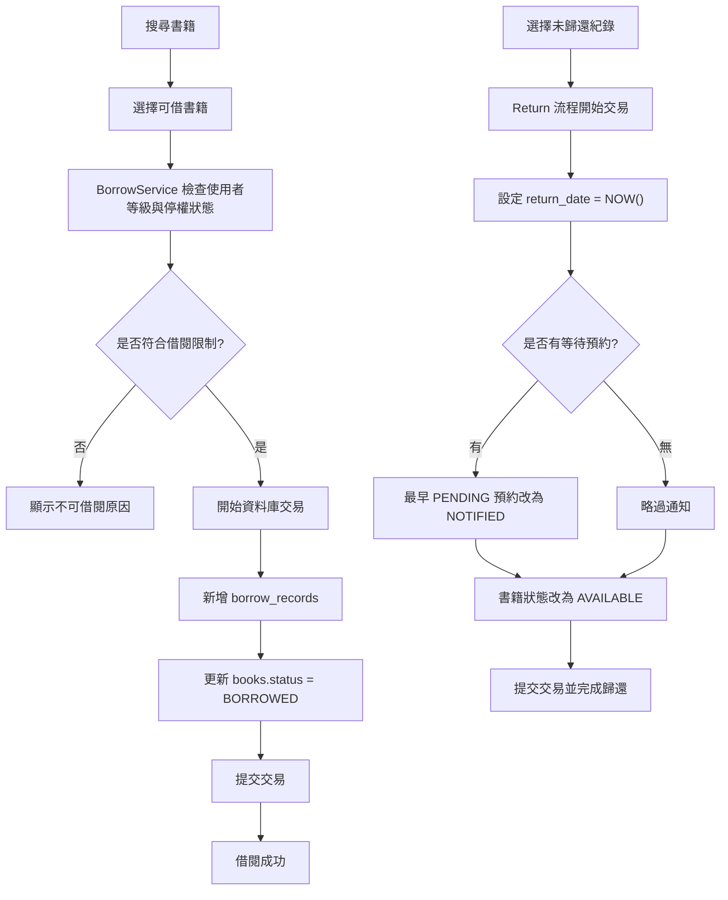
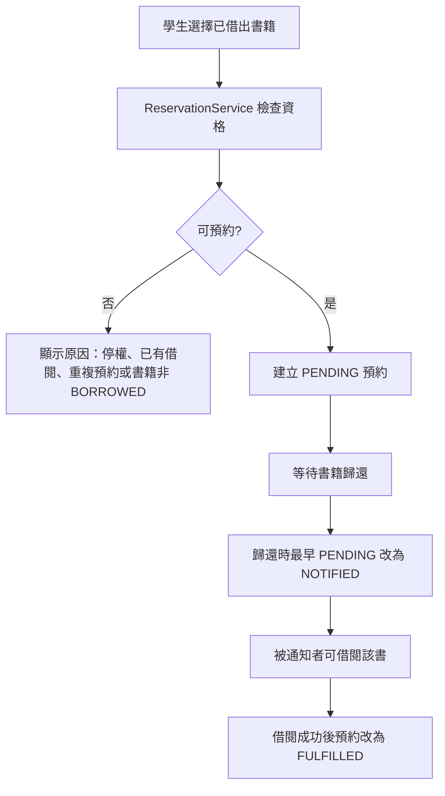
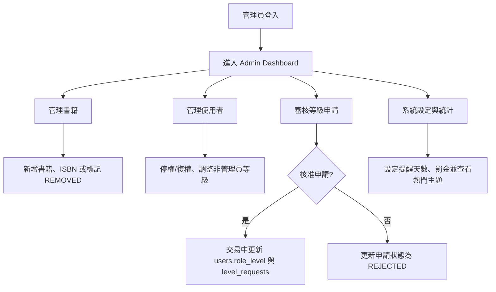
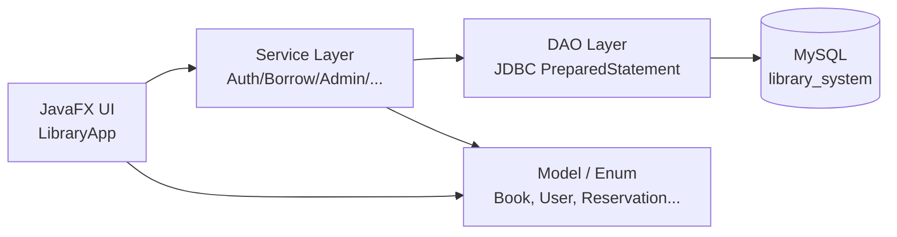

# 112-2 物件導向程式設計 指定題報告

## 題目名稱

圖書借閱與歸還管理系統

## 一、組員資料

| 組員 | 學號 | 姓名 | 主要負責內容 |
| --- | --- | --- | --- |
| 組員 A | 待填 | 待填 | 系統架構、資料庫設計 |
| 組員 B | 待填 | 待填 | DAO、Service、交易流程 |
| 組員 C | 待填 | 待填 | JavaFX GUI、操作流程 |
| 組員 D | 待填 | 待填 | 測試資料、文件、整合驗證 |

## 二、系統架構及功能簡介

本系統是一個以 Java 17 與 JavaFX 製作的桌面版圖書館管理系統，資料儲存在 MySQL，程式透過 JDBC 與 PreparedStatement 存取資料庫。整體採用分層架構，將 GUI、商業規則、資料存取與模型物件分開，降低畫面程式與 SQL/交易邏輯互相混雜的問題。

主要功能如下：

- 一般學生註冊、登入、查詢書籍、借書、還書、查看借閱紀錄。
- 學生可預約已借出的書、管理收藏、查看到期提醒與罰金。
- 學生可對已歸還的借閱紀錄留下 1 至 5 分評論。
- 學生可提出等級變更申請，例如由一般學生申請 VIP。
- 管理員可檢視全站借閱紀錄、搜尋學生紀錄、新增或移除書籍。
- 管理員可停權或恢復使用者、調整使用者等級、審核等級申請。
- 管理員可設定提醒天數與逾期每日罰金，並查看主題熱門度與統計資料。

## 三、使用套件與技術

| 類別 | 技術 |
| --- | --- |
| 程式語言 | Java 17、Python 3 |
| GUI | JavaFX Controls、JavaFX Graphics |
| 建置工具 | Maven |
| 資料庫 | MySQL、SQL |
| 資料庫連線 | JDBC、MySQL Connector/J |
| 資料存取 | PreparedStatement、ResultSet mapping |
| 樣式 | CSS (`src/main/resources/app.css`) |
| 測試資料 | `scripts/generate_seed.py` 由 JSON 資料集產生 `sql/seed.sql` |

## 四、流程圖

### 4.1 登入與註冊流程



### 4.2 借書與還書流程



### 4.3 預約流程



### 4.4 管理員管理流程



### 4.5 分層架構流程



## 五、Package 規劃

```text
src/main/java/com/librarysystem
├── model
│   ├── Book, User, BorrowRecord, Reservation, Review
│   ├── UserLevel, LibrarySettings, LevelRequest, SubjectPopularity
│   └── BookStatus, UserStatus, RoleLevel
├── dao
│   ├── BookDao, UserDao, BorrowRecordDao
│   ├── ReservationDao, FavoriteDao, ReviewDao
│   ├── LevelDao, LevelRequestDao, SettingsDao
├── service
│   ├── AuthService, BookService, BorrowService, AdminService
│   ├── ReservationService, FavoriteService, ReviewService
│   ├── LevelService, SettingsService
├── ui
│   └── LibraryApp
└── util
    ├── Database, PasswordUtil, ValidationUtil, DateUtil
```

## 六、Design Pattern / 架構模式

| 模式 | 本專案用法 |
| --- | --- |
| DAO Pattern | `dao` 套件集中 SQL、PreparedStatement 綁定與 ResultSet 轉換，UI 與 Service 不直接寫 SQL。 |
| Service Layer | `service` 套件集中商業規則，例如借閱限制、停權檢查、預約規則、等級申請審核。 |
| Layered Architecture | UI、Service、DAO、Model、Util 分層，降低各層耦合。 |
| MVC-style Separation | JavaFX 畫面負責顯示與事件，Model 表示資料，Service/DAO 處理控制流程與資料更新。 |
| Transaction Script | 借書、還書、審核等級申請等流程以明確交易步驟完成，失敗時 rollback。 |
| Data-driven Permission | 使用 `user_levels` 資料表決定借閱天數、借閱上限、收藏權限與管理員權限。 |

## 七、資料庫設計

資料庫名稱為 `library_system`，共 10 個主要資料表。

| Table | 主要欄位 | Key / 關聯 | 說明 |
| --- | --- | --- | --- |
| `user_levels` | `level_code`, `display_name`, `max_borrow_days`, `max_active_loans`, `can_favorite`, `is_admin`, `registration_allowed`, `custom_level` | PK: `level_code` | 使用者等級與權限設定來源。 |
| `users` | `user_id`, `student_no`, `name`, `password_hash`, `role_level`, `created_at`, `status` | PK: `user_id`; UK: `student_no`; FK: `role_level -> user_levels.level_code` | 學生與管理員帳號。 |
| `books` | `book_id`, `title`, `authors`, `subjects`, `publisher`, `publish_year`, `status` | PK: `book_id` | 書籍主資料，`REMOVED` 為軟刪除。 |
| `book_isbns` | `isbn_id`, `book_id`, `isbn` | PK: `isbn_id`; UK: `(book_id, isbn)`; FK: `book_id -> books.book_id` | 一本書可有多個 ISBN。 |
| `borrow_records` | `record_id`, `user_id`, `book_id`, `borrow_date`, `due_date`, `return_date`, `borrow_days` | PK: `record_id`; FK: `user_id -> users`, `book_id -> books` | 借閱與歸還紀錄。 |
| `level_requests` | `request_id`, `user_id`, `requested_level_code`, `reason`, `status`, `admin_note`, `reviewed_by` | PK: `request_id`; FK: `user_id -> users`, `requested_level_code -> user_levels`, `reviewed_by -> users` | 學生等級變更申請。 |
| `favorites` | `user_id`, `book_id`, `created_at` | PK: `(user_id, book_id)`; FK: `user_id -> users`, `book_id -> books` | 收藏書籍，多對多關聯表。 |
| `reservations` | `reservation_id`, `user_id`, `book_id`, `status`, `requested_at`, `notified_at`, `fulfilled_at`, `cancelled_at` | PK: `reservation_id`; FK: `user_id -> users`, `book_id -> books` | 預約與通知狀態。 |
| `reviews` | `review_id`, `record_id`, `user_id`, `book_id`, `rating`, `comment`, `created_at` | PK: `review_id`; UK: `record_id`; FK: `record_id -> borrow_records`, `user_id -> users`, `book_id -> books`; CHECK: `rating BETWEEN 1 AND 5` | 已歸還借閱紀錄的評論。 |
| `app_settings` | `setting_key`, `setting_value`, `updated_at` | PK: `setting_key` | 系統設定，例如提醒天數與每日罰金。 |

主要關聯摘要：

- `users.role_level` 對應 `user_levels.level_code`，讓權限可由資料庫設定。
- `borrow_records` 同時關聯 `users` 與 `books`，代表某位使用者借了某本書。
- `reservations`、`favorites` 也是使用者與書籍之間的關聯資料。
- `reviews.record_id` 設為唯一，確保每筆借閱紀錄最多只能評論一次。

## 八、APP / GUI 介面截圖

本次文件先保留截圖位置；若要正式繳交，可在本機啟動 MySQL 並執行 JavaFX App 後補上圖片。

| 畫面 | 檔案位置建議 | 截圖內容 |
| --- | --- | --- |
| 登入/註冊 | `docs/screenshots/login.png` | Student Login、Admin Login、Register 三個分頁。 |
| 學生查詢與借閱 | `docs/screenshots/student-search.png` | 搜尋書籍、查看狀態、借閱、預約、收藏。 |
| 學生歸還與歷史 | `docs/screenshots/student-history.png` | 歸還清單、借閱歷史、評論。 |
| 管理員書籍管理 | `docs/screenshots/admin-books.png` | 新增書籍、ISBN、移除書籍。 |
| 管理員使用者/等級 | `docs/screenshots/admin-users-levels.png` | 停權復權、等級申請審核、設定。 |
| 統計與熱門主題 | `docs/screenshots/admin-statistics.png` | 統計數字與 Subject Popularity 圖表。 |

## 九、分工表

| 組員 | 工作項目 | 比例 |
| --- | --- | ---: |
| 組員 A | 架構規劃、資料庫 schema、資料表關聯設計 | 25% |
| 組員 B | DAO、Service、交易與商業規則實作 | 25% |
| 組員 C | JavaFX GUI、畫面流程、CSS 樣式 | 25% |
| 組員 D | Seed data、文件、測試與整合驗證 | 25% |
| **合計** |  | **100%** |

## 十、其他說明

### Demo 帳號

| 身分 | 帳號 | 密碼 |
| --- | --- | --- |
| 管理員 | `admin` | `admin123` |
| 一般學生 | `S001` | `password123` |
| VIP 學生 | `S002` | `password123` |

### 建置與執行

```bash
mvn clean compile
mysql -uroot < sql/schema.sql
mysql -uroot < sql/seed.sql
mvn javafx:run
```

若 MySQL 帳號、密碼、host 或 port 不同，需修改：

```text
src/main/resources/db.properties
```

### 已知限制

- 目前沒有自動化測試框架，主要以 `mvn clean compile` 與手動操作流程驗證。
- JavaFX 事件處理多為同步呼叫，資料量很大時可再加入背景工作執行緒。
- `NOTIFIED` 預約目前沒有自動過期機制。
- 罰金以目前設定即時計算，沒有寫入歷史罰金快照。

### 安全與設定注意事項

- 不應提交真實資料庫密碼。
- Demo 帳號只供本機展示使用。
- 新註冊帳號會以 SHA-256 雜湊儲存密碼。
- Runtime SQL 查詢集中在 DAO，並使用 PreparedStatement 降低 SQL Injection 風險。
